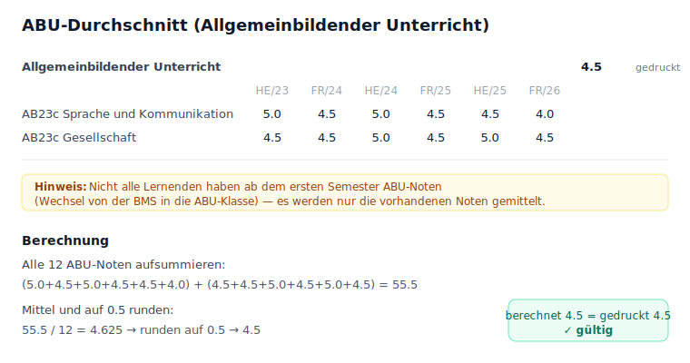
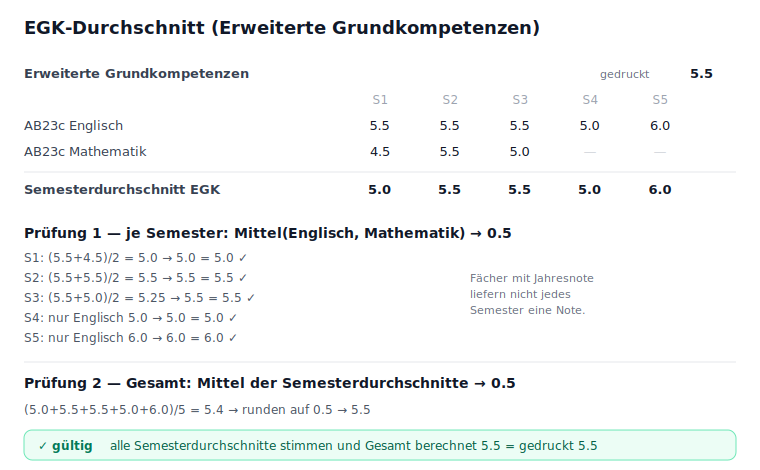

# Validierungsregeln — Modulzeugnis-Validator

Dieses Dokument beschreibt, wie der Validator die Noten eines Modulzeugnisses
nachrechnet und gegen die **gedruckten** Werte prüft. Grundprinzip: der
Validator erfindet keine Sollwerte, sondern rechnet nur aus den auf dem Zeugnis
sichtbaren Noten die Durchschnitte nach und vergleicht sie mit den ebenfalls
gedruckten Durchschnitten. Stimmen sie nicht, wird das Zeugnis markiert.

## Notenskala

- Noten von **1.0 bis 6.0** in **0.5-Schritten** (Halbnoten).
- Durchbewertung: ab **4.0 genügend**, darunter ungenügend.
- Runden auf 0.5 (`round05`): kaufmännisch, `4.24 → 4.0`, `4.25 → 4.5`.
- Modul-Durchschnitt wird auf **0.1** gedruckt (`round01`).

---

## 1. Modul-Durchschnitt

Der Modul-Durchschnitt ist das arithmetische Mittel **aller benoteten Module**,
gerundet auf 0.1.

```
berechnet = round01( Mittel(alle Modulnoten) )
gültig    = | berechnet − gedruckt | ≤ 0.11
```

Die Toleranz `MODULE_AVG_TOLERANCE = 0.11` fängt Rundungsdifferenzen der 0.1er
Anzeige ab. Nicht benotete Zeilen (Pnab, dispensiert) fliessen **nicht** ins
Mittel ein.

## 2. Pnab — «Prüfung nicht absolviert»

Steht bei einem Modul statt einer Note **`Pnab`**, wird das Modul als nicht
absolviert markiert. Es zählt nicht zum Durchschnitt, und das Zeugnis wird im
UI hervorgehoben (Banner + oranger Rahmen an der Karte).

## 3. dispensiert (disp.)

`disp.` erscheint bei Nicht-Modul-Fächern (z. B. Sport). Diese Zeilen sind
keine Module und werden für die Modul-Validierung ignoriert.

---

## 4. ABU — Allgemeinbildender Unterricht

**Regel:** Der ABU-Bereich listet immer **alle** Einzelnoten (Sprache und
Kommunikation, Gesellschaft) über alle geführten Semester. Der ABU-Durchschnitt
ist das Mittel **aller** dieser Noten, gerundet auf 0.5.

> **Wichtig:** Nicht alle Lernenden haben ab dem ersten Semester ABU-Noten —
> wer zuerst in der BMS war und später in die ABU-Klasse gewechselt ist, hat
> weniger Einzelnoten. Gemittelt werden nur die **vorhandenen** Noten, nicht
> eine feste Anzahl Semester.



```
berechnet = round05( Mittel(alle ABU-Einzelnoten) )
gültig    = berechnet == gedruckter ABU-Durchschnitt
```

### Erkennungsgrenze bei ABU

Das Zeugnis druckt bei ABU **nur einen Gesamtdurchschnitt** — keine
Semesterzwischenwerte. Eine einzelne falsche Einzelnote, die den gerundeten
Gesamtschnitt **nicht** verschiebt, ist deshalb mathematisch **nicht
erkennbar**. Beispiel: eine Gesellschaftsnote von 4.5 → 3.5 verschiebt den
Rohschnitt von 5.0625 auf 4.9375 — beides rundet auf **5.0**, der gedruckte
Referenzwert bleibt gleich. Solche Fälle kann der Validator aus den gedruckten
Daten prinzipiell nicht aufdecken.

---

## 5. EGK — Erweiterte Grundkompetenzen

**Regel:** Der EGK-Bereich weist **beides** aus — den **Semesterdurchschnitt**
je Semester **und** den **Gesamtdurchschnitt**. Der Validator prüft beide.

> **Wichtig:** Wie bei ABU sind nicht alle Lernenden von Anfang an dabei (z. B.
> vorher in der BM). Zudem geben manche Fächer eine Note über ein ganzes Jahr
> statt pro Semester — deshalb hat nicht jedes Fach in jedem Semester eine Note.



**Prüfung 1 — je Semester:** der gedruckte Semesterdurchschnitt muss dem Mittel
der in diesem Semester geführten EGK-Fächer (Englisch, Mathematik) entsprechen.

```
sem_berechnet = round05( Mittel(vorhandene Fachnoten des Semesters) )
sem_gültig    = sem_berechnet == gedruckter Semesterdurchschnitt
```

**Prüfung 2 — Gesamt:** der gedruckte EGK-Gesamtdurchschnitt muss dem Mittel
der Semesterdurchschnitte entsprechen.

```
gesamt_berechnet = round05( Mittel(alle Semesterdurchschnitte) )
gesamt_gültig    = gesamt_berechnet == gedruckter EGK-Durchschnitt
```

### Separates EGK/ABU-Zeugnis (Mediamatiker)

Nur Informatiker führen ABU/EGK auf dem Modulzeugnis. Bei Mediamatikern (und
IMS) stehen diese Noten auf einem **eigenen** Zeugnis, das andere EGK-Fächer
listet (Englisch, Französisch, Betriebskommunikation, Marketingfachsprache)
statt Englisch/Mathematik. Der Validator erkennt solche Zeugnisse ohne
Modulnoten, unterdrückt den Modul-Durchschnitt und prüft nur ABU/EGK.

### Semesterzuordnung je Semester

Prüfung 1 braucht die Zuordnung Fachnote → Semester; die entsteht aus der
Spaltenreihenfolge von links. Ein jahresweise benotetes Fach (z. B. Mathematik)
liefert nicht in jedem Semester eine Note, und **welches** Semester fehlt, geht
beim Flachklopfen des PDF-Textes verloren — die natürliche Reihenfolge ist dann
falsch. Ein Semester gilt darum als **gültig**, wenn der gedruckte
Semesterdurchschnitt entweder in natürlicher Spaltenreihenfolge aufgeht **oder**
nach einer gültigen Umsortierung der Mathematik-Spalten (bipartites Matching).
Die Umsortierung stellt nur die verlorenen Spalten wieder her; das Ergebnis ist
rechnerisch korrekt. **Ungültig** ist ein Semester nur, wenn keine Zuordnung der
gedruckten Noten den Semesterdurchschnitt erklärt.

Der EGK-Bereich ist ungültig, wenn der Gesamtschnitt abweicht oder ein Semester
ungültig ist. Fehlt die vollständige Englisch-Zeile oder kommen keine Fachnoten
vor (Mediamatiker), entfällt Prüfung 1 — die robuste **Prüfung 2** (Mittel der
gedruckten Semesterdurchschnitte) greift immer.

---

## 6. Was im UI angezeigt wird

- **Rotes Banner (ABU/EGK):** listet jedes Zeugnis mit ABU- oder EGK-Notenfehler,
  inkl. betroffenem Bereich und — bei EGK — betroffenem Semester.
- **Oranges Banner (Pnab):** listet Zeugnisse mit «Prüfung nicht absolviert».
- **Studenten-Karte:** grün/rot je Bereich; EGK-Semesterzellen grün (gültig) /
  rot (ungültig); Karte bekommt einen roten Ring bei ABU/EGK-Fehler, orange bei Pnab.
- **Curriculum-Check:** Rasterabgleich der belegten Module gegen den Lehrplan;
  **fehlende** (im Dokument nicht vorkommende) Module amber mit ✗ und
  Zähler-Badge, statt blass ausgegraut.

## 7. Wo im Code

| Regel | Ort |
| --- | --- |
| Runden, Toleranz, `matchesPrinted` | [utils/grades.ts](../utils/grades.ts) |
| Modul-, ABU-, EGK-, Pnab-Extraktion | [services/parserService.ts](../services/parserService.ts) |
| Banner & Badges | [components/Dashboard.tsx](../components/Dashboard.tsx), [components/StudentCard.tsx](../components/StudentCard.tsx) |
| EGK-Semester-Matching (bipartit) | [services/parserService.ts](../services/parserService.ts) (`validateEgkSemesters`) |
| Test-Harness (3 Modul-PDFs + ABU-Zeugnis) | [tests/harness.ts](../tests/harness.ts) |
